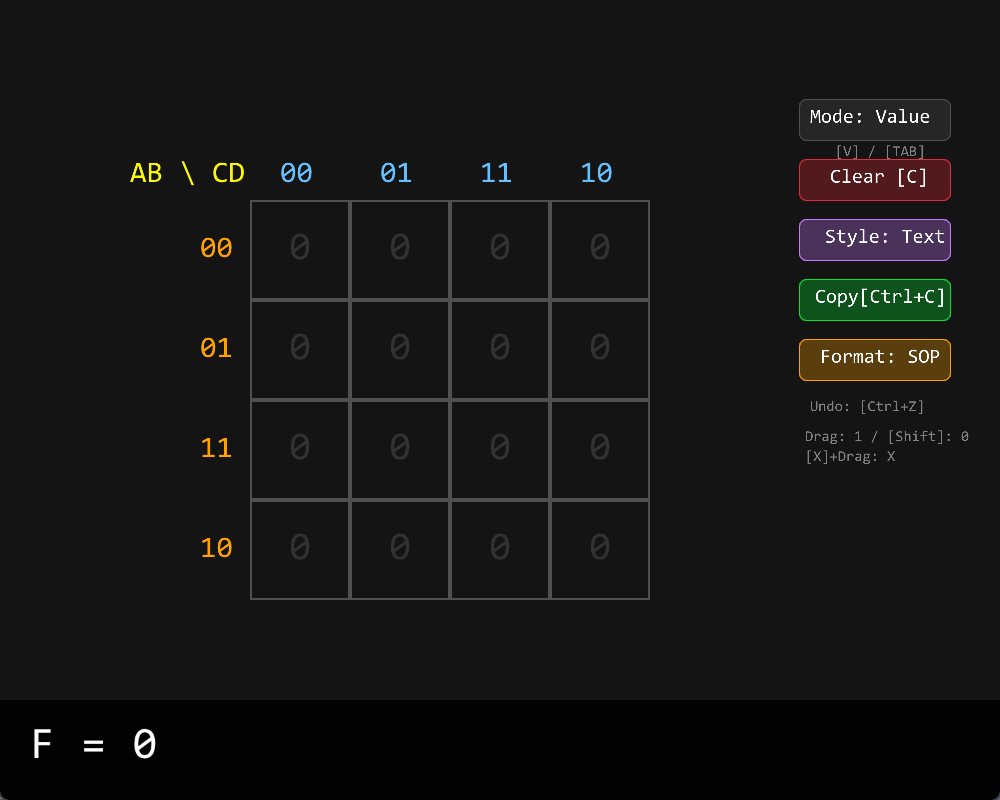

# K-Map Solver (卡諾圖化簡器)

一個基於 C++ 與 Raylib 開發的高效能卡諾圖化簡工具。
專為數位邏輯設計課程打造，支援 Quine-McCluskey 演算法，並提供流暢的圖形化操作介面。


*(請記得把您的程式截圖命名為 screenshot.png 並放在專案資料夾，或直接在 GitHub 網頁上編輯 README 時把圖片拖進去)*

## ✨ 特色 (Features)

* 🚀 **單一執行檔 (Portable)**：內建字體與圖示，無需安裝，無需依賴 DLL，隨插隨用。
* 🧮 **強大演算法**：內建 Quine-McCluskey 演算法，支援 SOP (Sum of Products) 與 POS (Product of Sums) 雙模式化簡。
* 🎨 **霓虹風格 UI**：現代化的暗色介面，支援視覺化分組顯示 (Wrapping Groups)。
* 🖱️ **流暢互動**：支援滑鼠拖曳塗抹、快捷鍵操作。
* ↩️ **復原系統**：支援 Ctrl+Z 復原 (Undo)，操作失誤也不怕。

## 🎮 操作說明 (Controls)

| 按鍵 / 操作 | 功能描述 |
| --- | --- |
| **滑鼠左鍵 (點擊)** | 切換 0 / 1 |
| **滑鼠左鍵 (拖曳)** | 筆刷塗抹 (預設塗抹 1) |
| **Shift + 點擊/拖曳** | 強制塗抹 **0** (橡皮擦) |
| **X + 點擊/拖曳** | 強制塗抹 **X** (Don't Care) |
| **Tab** 或 **V** | 切換顯示模式 (數值 Value / 索引 Index) |
| **C** | 清除表格 (Clear) |
| **Ctrl + C** | 複製化簡後的公式 |
| **Ctrl + Z** | 復原上一步 (Undo) |

## 🛠️ 如何建置 (How to Build)

本專案使用 CMake 與 Raylib (透過 FetchContent 自動下載)。

### 需求
* C++ 編譯器 (建議 MSVC 或 MinGW)
* CMake 3.14+

### 建置步驟

```bash
# 1. 建立 build 資料夾
cmake -B build

# 2. 開始編譯 (Release 模式)
cmake --build build --config Release

# 3. 編譯完成後，執行檔將位於 build/Release/KmapApp.exe